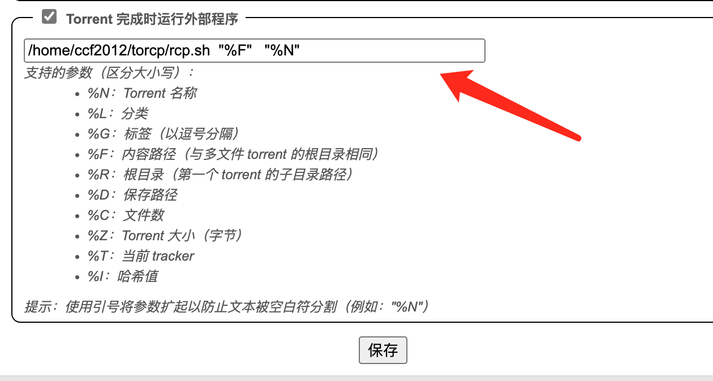
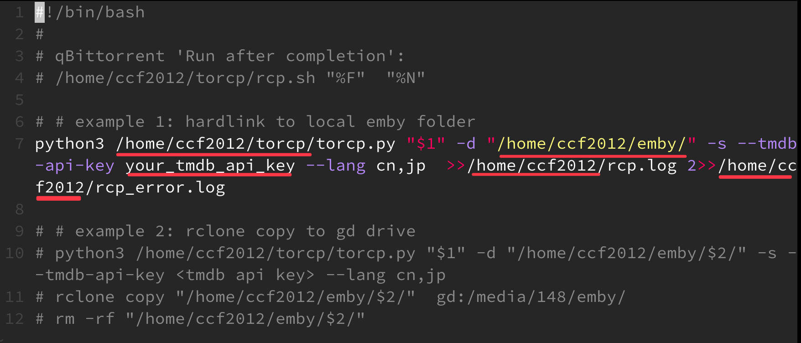
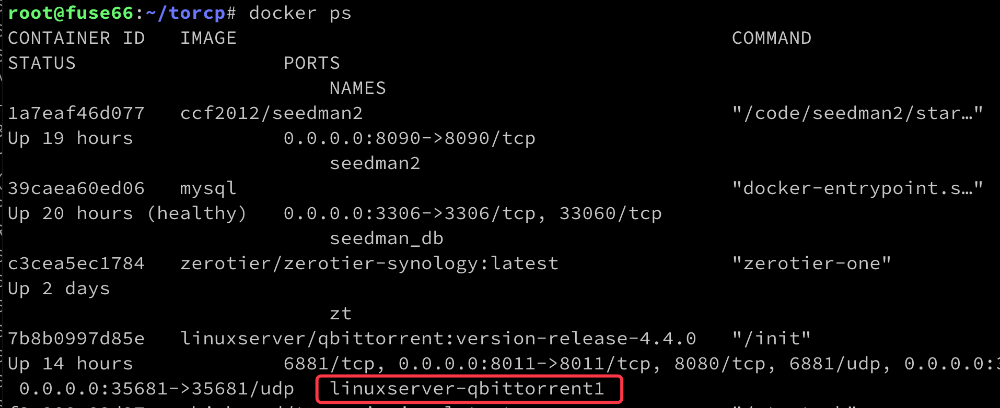
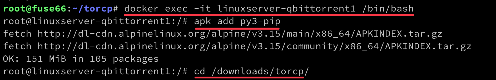
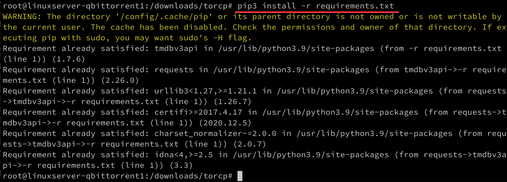
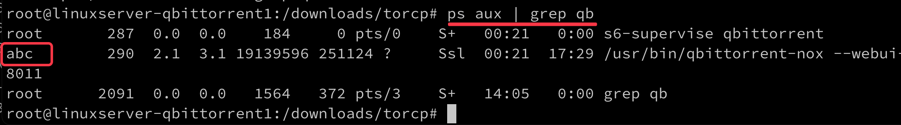
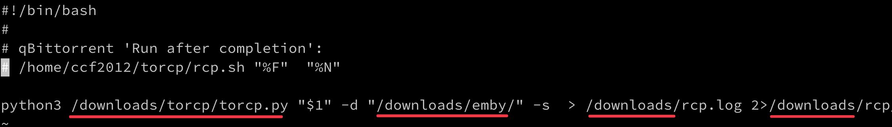

# 利用 qBittorrent 的完成后自动执行脚本功能实现入库
* qBittorrent提供一种下载完成自动运行脚本的功能，可以利用这个功能运行torcp 自动入库

简要的流程：
* QB中作简单的设置，使一个种子下载完成后，QB将种子下载的完整路径传递给脚本`rcp.sh`，并调用脚本执行
* `rcp.sh` 中可以按自己想要的路径和方式调用 `torcp` 硬链到媒体库的存储位置

## QB非docker安装
* 假设 torcp 在 `/home/ccf2012/torcp` 位置
* qBittorrent的 'Torrent完成时运行外部程序' / 'Run after completion' 中填写命令：
```sh
/home/ccf2012/torcp/rcp.sh  "%F" "%N"
```
其含义为：当一个种子下载完成后，运行 `/home/ccf2012/torcp/rcp.sh` 脚本，传入参数 `%F` 种子的下载完整路径，`%N` 为种子名。由于文件名经常有空格，所以这里需要用引号 `"` 引起来。




### 硬链到同分区目录入媒体库
假设 torcp 已经安装好依赖，可以独立运行，可以试试 `python3 torcp.py -h` 看有没有出错。
对应于上面QB中所设置的脚本位置 `/home/ccf2012/torcp/rcp.sh` ，修改其内容，注意修改其中的:
1. 确认torcp.py 的位置，即下面示例中的： `/home/ccf2012/torcp/torcp.py` 
2. 媒体库目录，下面示例中的： `/home/ccf2012/emby/`
3. TMDb的api key： `your_tmdb_api_key`
4. log输出的位置： `/home/ccf2012/rcp.log` 和 `/home/ccf2012/rcp_error.log`

```sh 
#!/bin/bash
python3 /home/ccf2012/torcp/torcp.py "$1" -d "/home/ccf2012/emby/" -s --tmdb-api-key your_tmdb_api_key --lang cn,jp  >>/home/ccf2012/rcp.log 2>>/home/ccf2012/rcp_error.log
```



* 下载一个种子，完成后，查看 `rcp_error.log` 和 `rcp.log`


### 拷到 rclone 目标(如gd, od)
如果想将下载的种子，拷到gd drive上，可这样写 `rcp.sh` ，注意修改其中的:
1. torcp位置 `/home/ccf2012/torcp/`
2. 暂存路径 `/home/ccf2012/emby` (3处) 
3. `tmdb-api-key`
```sh 
#!/bin/bash
python3 /home/ccf2012/torcp/torcp.py "$1" -d "/home/ccf2012/emby/$2/" -s --tmdb-api-key your_tmdb_api_key --lang cn,jp  >>/home/ccf2012/rcp.log 2>>/home/ccf2012/rcp_error.log

rclone copy "/home/ccf2012/emby/$2/"  gd:/media/148/emby/
rm -rf "/home/ccf2012/emby/$2/"
```

解说一下：
* 这里用到了QB传来的第2个参数 `%N` 种子名，用来作唯一性的暂存位置（假设没有手工特意组织多级目录下放同名的种子)
* 新下载的种子，将在 `/home/ccf2012/emby/种子名/` 这里构建多层的硬链目录，比如 `TV\纸房子 (2017)\S01\...`，作为暂存
* 调用rclone copy 将暂存的文件夹，往 gd 拷贝
* 拷贝完成后删除暂存


## QB以docker安装
* 如果QB以docker方式安装，则需要在docker中运行torcp，且所指向的存储位置，都应当是docker所理解的位置。 (此处致谢  @Ozz)

* 要硬链的目录文件夹，应当放在docker所mount的存储位置(volume)内，torcp也可以在此，比如 `/downloads` 所对应的目录下内容类似如下：
```
/
├── downloads/
│   ├── emby/
│   ├── torcp/
│   └── ....
```

* `docker ps` 查看机器上qb docker的名字


* 假设安装的docker名为 `linuxserver-qbittorrent1` , 需要进入docker shell中进行操作:
```sh
docker exec -it linuxserver-qbittorrent1 /bin/bash
```

QB的docker，一般是Alphine Linux，已经安装有 python3, 这样可以在docker shell内作以下：
1. `apk add py3-pip`  安装 `pip3`
2. `cd /downloads/torcp/` 转到torcp目录下，`pip3 install -m requirements.txt` 安装依赖



3. 确定QB的读写权限，保证QB可以读写 `/downloads/emby/` 目录。如QB在Docker中的用户名是`abc`，则：
```sh
chown -R abc /downloads/emby/
```


4. 修改 `rcp.sh` 内容如下：
```sh 
#!/bin/bashs
python3 /downloads/torcp/torcp.py "$1" -d "/downloads/emby/" -s --tmdb-api-key your_tmdb_api_key --lang cn,jp  >>/downloads/torcp/rcp.log 2>>/downloads/torcp/rcp_error.log
```

> 此示例中未使用tmdb查询

5. 下载一个种子，完成后，查看 `rcp_error.log` 和 `rcp.log`

